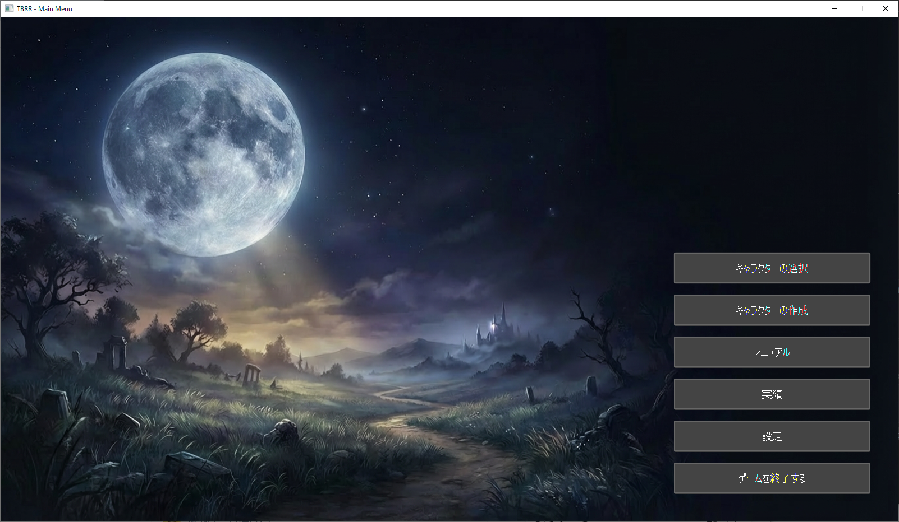
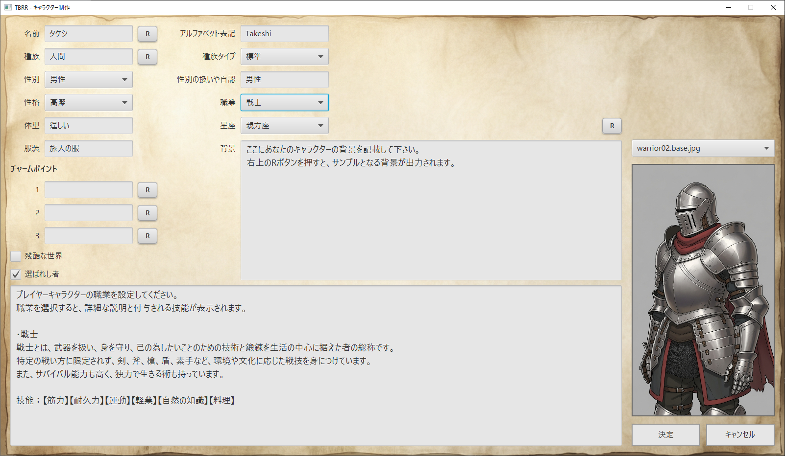
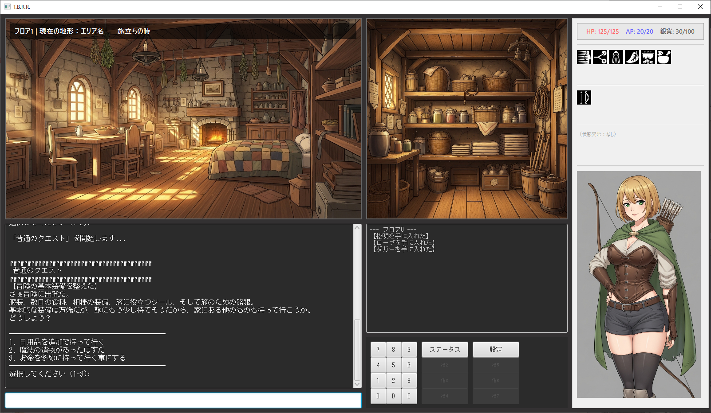
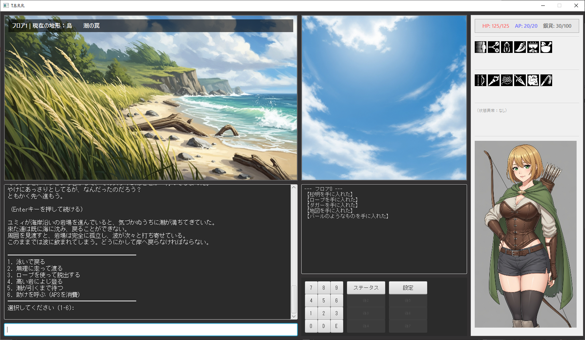

# TBRR (Text-Based Roguelite RPG)

JavaFXとテキストベースのインターフェースを組み合わせた、ローグライトRPGです。

【この手のゲーム経験者向けの要約】<br>
古典的TRPGのようなシステムで、FTL: Faster Than LightやSlay the Spireのようなゲームの選択肢の部分だけを延々とやるゲームです。

## 目次
- [スクリーンショット](#スクリーンショット)
- [技術スタック](#技術スタック)
- [開発体制](#開発体制)
- [ビルド方法](#ビルド方法ソースコード確認用)
- [ライセンス](#ライセンス)
- [作者](#作者)

## スクリーンショット

### メインメニュー


### キャラクター作成


### ゲームプレイ




> [!IMPORTANT]
> **ソースコードのみの公開です**
> このリポジトリには、ゲームの実行に必要な素材データ（画像、シナリオ、イベントデータ等）は含まれていません。
> これは素材のライセンス保護およびゲームのネタバレ防止のためです。
>
> プレイ可能な完全版は、**[Releases](../../releases)** ページからダウンロードしてください（現在準備中）。

## 技術スタック
- **言語**: Java 21
- **UIフレームワーク**: JavaFX
- **データ管理**: JSON (Gson)
- **ビルドツール**: Maven
- **配布形式**: jpackage (Native Installer/Image)
- **開発環境**: Eclipse 2024-12 (Pleiades), Google Antigravity

## 開発体制
このプロジェクトは開発者が主導し、AIをツールとして活用して制作されました。

### 開発者が担当
- ゲームデザイン・要件定義（TRPG的なルールセットの落とし込み）
- システム設計・アーキテクチャ方針の決定
- シナリオのプロット・素案作成
- 全体の品質管理・最終調整

### AI支援ツールの活用箇所
- **開発全般**: Claude (Anthropic), Gemini (Google)
- **ゲームデザイン補助**: ChatGPT (OpenAI), Grok
- **コード補完**: GitHub Copilot（試用）
- **画像生成**: AI画像生成ツール（本リポジトリからは除外）

## ビルド方法（ソースコード確認用）
素材データがないため、このままビルドしてもゲームは正常に動作しませんが、コンパイルの確認は可能です。

```bash
mvn clean package
```

## ライセンス
Copyright (c) 2025 KH-Games (K.H.)
All Rights Reserved.

本リポジトリのソースコードは、ポートフォリオとしての閲覧を目的として公開されています。
無断での複製、改変、再配布、商用利用を禁じます。

## 作者
**K.H. (KH-Games)**
- GitHub: [KH-Mind](https://github.com/KH-Mind)
